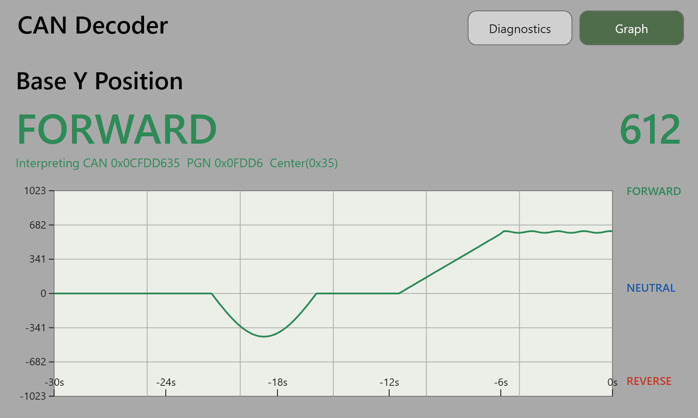
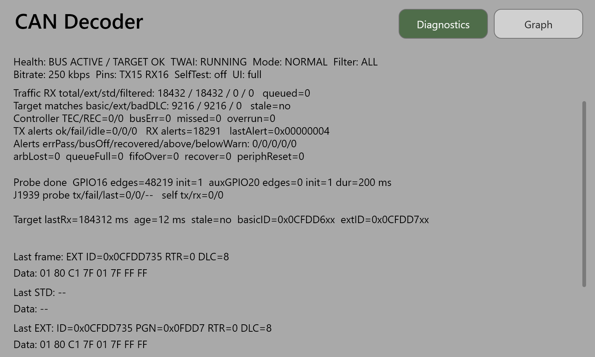
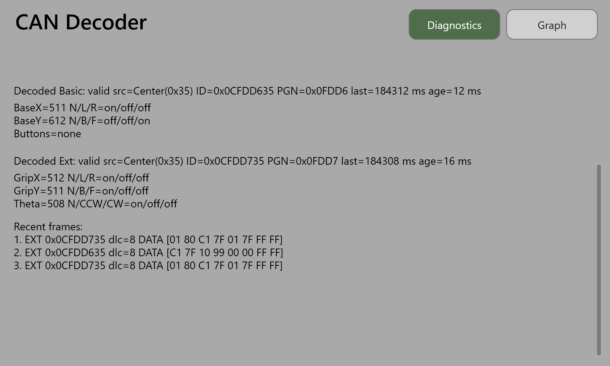

# canBUS rotary hall switch display

A handheld test box for rotary hall switches that talk over CAN bus.

Plug a switch in, power it up, and this 4.3" touchscreen tells you whether the switch is alive,
what it is reporting, and whether the CAN wiring is healthy. No laptop, no CAN analyzer software,
no oscilloscope.



## Why this exists

A rotary hall switch is a contactless position sensor. Turning the handle moves a magnet past a
sensor, and the sensor reports the angle. Machine operators use them as joysticks and directional
controls. Because nothing inside physically touches, they are used where a mechanical switch would
wear out or spark.

These switches do not run a simple wire per position. They report their angle as digital messages
on a CAN bus, the same two-wire network used by cars and heavy equipment. That makes them harder to
test. A multimeter tells you nothing useful, because the information is in the message traffic, not
in a voltage.

The usual answer is a laptop, a USB CAN adapter, and analyzer software. That is slow to set up, hard
to take to the machine, and it shows raw hexadecimal that somebody still has to translate.

This project is the shortcut. It is a purpose-built display that listens to one of these switches
and shows the answer in plain terms.

## What you can tell from the screen

Two screens, selected by the buttons in the top right corner.

The graph screen is the one you use to check a switch. It shows the main axis position over the
last 30 seconds, a large number for the current reading, and a word for the direction: FORWARD in
green, REVERSE in red, NEUTRAL in blue. Turn the switch by hand and the trace should follow
smoothly. A flat line, a jumpy trace, or a reading that sticks off-center points at a bad switch.
That is the screen at the top of this page.

The diagnostics screen is the one you use when nothing is showing up. It reports whether the bus is
carrying traffic, how many messages have arrived, which switch address is sending them, the error
counters from the CAN controller, and the raw bytes of the last few messages.



Scrolling down on the same screen shows the decoded values: both stick axes, the twist axis, and
which of the 12 grip buttons are pressed.



The top line is the quick verdict. `BUS ACTIVE / TARGET OK` means the switch is talking and being
understood. `NO BUS ACTIVITY` means the wiring or the power is wrong. `BUS ACTIVE / NO TARGET PGN`
means something is on the bus, but it is not the switch you expected.

## Hardware

One board does everything: a Waveshare `ESP32-S3-Touch-LCD-4.3B`.

- 800 x 480 capacitive touchscreen, 4.3 inch
- ESP32-S3 dual-core processor, 16 MB flash, 8 MB PSRAM
- CAN transceiver already on the board, wired to `GPIO15` and `GPIO16`
- Screw terminals for CAN and for 7-36 V input, so it runs off the same supply as the switch
- USB-C for power and for loading firmware

Nothing else is required. The switch under test needs its own 24 V supply and a ground shared with
the display.

Bench wiring for the RH112 units tested so far:

| Wire  | Connect to |
|-------|------------|
| red   | +24 V DC   |
| black | 0 V / ground |
| blue  | CAN H      |
| white | CAN L      |

Getting red and black backwards was the single biggest time sink during bring-up. The board still
boots and the screen still lights up, but no CAN traffic ever arrives.

## What the firmware does

The switches follow J1939, an industrial CAN standard, running at 250 kbit/s. Each switch sends two
messages, roughly 100 times a second:

- `0x0CFDD6xx` carries the base stick X and Y positions and the 12 button states
- `0x0CFDD7xx` carries the grip X and Y positions and the twist (theta) position

The last two digits identify which switch is sending: `33` right, `34` left, `35` center, `36`
auxiliary. Each axis is a 10-bit number from 0 to 1023, packed across two bytes alongside status
bits that say whether the axis is centered, pushed one way, pushed the other, faulted, or not
fitted.

The firmware starts the display, starts the CAN controller, reads every frame that arrives, pulls
those numbers out, and redraws the screen. It only listens. It never sends commands to the switch
or to anything else on the bus.

## Repository guide

- `main/` is the firmware source: startup, CAN handling, the screen, and board setup
- `main/canbus/` holds the CAN receive loop and the message decoder
- `main/ui/` holds the screen layout, built with the LVGL graphics library
- `docs/documentation.md` is the full technical walkthrough
- `docs/hardware/` covers the board pinout and the switch message format
- `docs/images/` holds the screen captures above, with the HTML used to render them in `source/`
- `can.md` covers the CAN implementation and diagnostics behavior in detail
- `flash.ps1` loads firmware onto the board
- `monitor-safe.ps1` attaches a serial monitor without the hangs the stock tool hits on this setup

## Building and flashing

The project builds with ESP-IDF. From a terminal with the ESP-IDF environment loaded:

```bash
idf.py build
```

Then flash with `flash.ps1`, attach the serial monitor with `monitor-safe.ps1`, and connect a
switch. The screen shows `WAITING FOR FRAMES` until traffic arrives.

## Diagnostic modes

Normal mode is the default and is what you want on a bench or in the field. Three other modes exist
for tracking down bus problems, set at build time in `main/canbus/canbus_config.h`:

- listen-only, which never acknowledges frames and so cannot disturb a live bus
- no-ack self-test, for checking the board's own CAN path with nothing else connected
- minimal mode, which skips the screen entirely and reports over the serial port

## Status

The prototype works. It decodes and displays live traffic from RH112 units at addresses `0x34` and
`0x35`. Termination resistors still need checking against real machine wiring, since the switch
documentation does not specify them.

## Images in this README

The screen captures above are rendered from the firmware's own layout code rather than photographed
off the panel, so the text is sharp at 800 x 480. The values shown are from a bench session with a
center switch. The HTML that produces them is in `docs/images/source/`.
